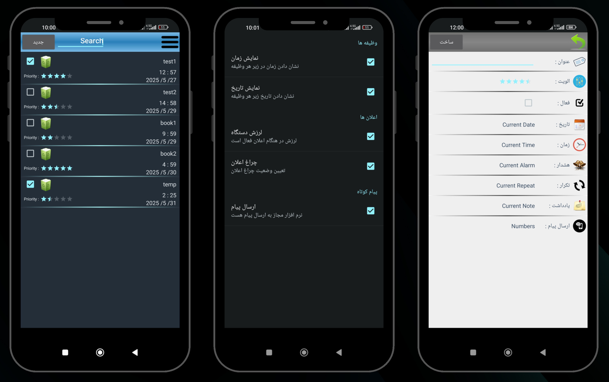

# Reminder

Reminder is an Android app that helps you remember everything. It allows you to create reminders for tasks, and also send texts or group messages to a list of phone numbers.



## Features

- Create and manage reminders with priority, date, time, and repetition.
- Group messaging: send SMS to multiple contacts at once.
- Custom notes and extra information for each reminder.
- Notification and alarm support.
- Settings for notification vibration, light, and SMS permissions.
- Persian language support in UI.


## Getting Started

### Prerequisites

- Android Studio (or compatible IDE)
- Android SDK (minSdkVersion: 8, targetSdkVersion: 22)
- Gradle

### Building the Project

1. Clone the repository:
    ```sh
    git clone https://github.com/yourusername/reminder-app.git
    ```
2. Open the project in Android Studio.
3. Let Gradle sync and download dependencies.
4. Build and run the app on an emulator or device.

### Project Structure

- `reminder/` - Main app module
    - `src/main/java/ali/bozorgzad/project/app/reminder/` - Java source code
    - `src/main/res/` - Resources (layouts, drawables, etc.)
    - `src/main/AndroidManifest.xml` - App manifest
- `slidingMenuLibrary/` - Third-party sliding menu library

### Main Components

- [`ActivityStartup`](reminder/src/main/java/ali/bozorgzad/project/app/reminder/ActivityStartup.java): Main activity, displays list of reminders.
- [`ActivityReminderDetails`](reminder/src/main/java/ali/bozorgzad/project/app/reminder/ActivityReminderDetails.java): Add/edit reminder details.
- [`ActivityAlarm`](reminder/src/main/java/ali/bozorgzad/project/app/reminder/ActivityAlarm.java): Alarm notification activity.
- [`AdapterReminder`](reminder/src/main/java/ali/bozorgzad/project/app/reminder/AdapterReminder.java): Adapter for displaying reminders.
- [`BootCompleteReceiver`](reminder/src/main/java/ali/bozorgzad/project/app/reminder/BootCompleteReceiver.java): Handles device boot to reschedule alarms.
- [`ShowNotification`](reminder/src/main/java/ali/bozorgzad/project/app/reminder/ShowNotification.java): Broadcast receiver for notifications.

### Permissions

The app requests the following permissions:

- `RECEIVE_BOOT_COMPLETED`
- `SET_ALARM`
- `WRITE_EXTERNAL_STORAGE`
- `SEND_SMS`

See [AndroidManifest.xml](reminder/src/main/AndroidManifest.xml) for details.

## Contributing

Pull requests are welcome! For major changes, please open an issue first to discuss what you would like to change.

## License

This project is licensed under the MIT License.
